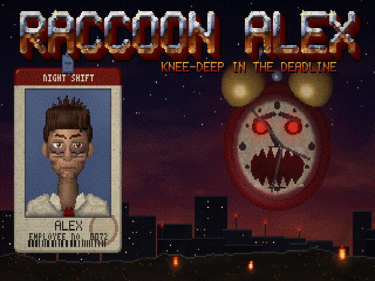
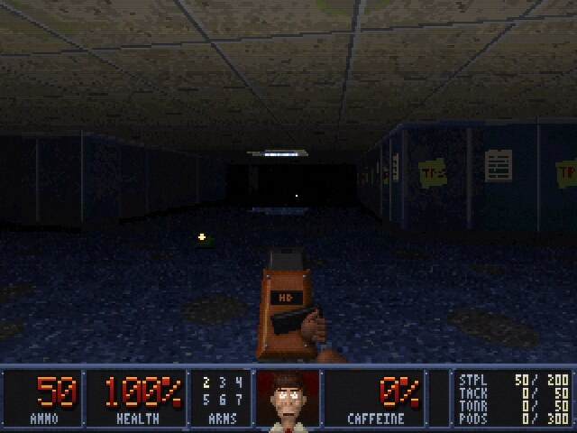
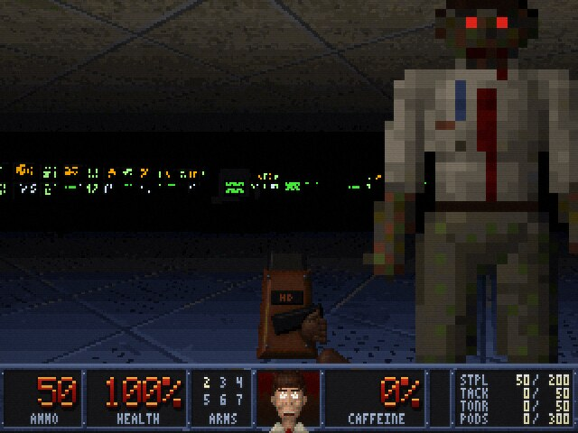
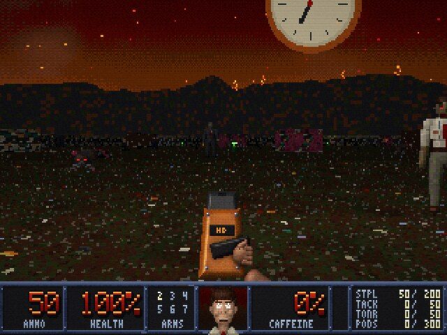

# RACCOON ALEX

*Knee-Deep in the Deadline.* A gritty, 80s-style first-person shooter that runs
in the browser.

It's 3 AM. Alex hasn't slept in 72 hours, and the bags under his eyes are
turning into a full raccoon mask. A jammed printer has opened a portal to the
Underoffice. Fight down through the cubicles, the server room, the basement
and the sewers to the Landfill of the Damned, and silence the Alarm King so
Alex can finally take a nap.



| | |
|---|---|
|  |  |
|  | |

## Play

Once GitHub Pages is switched on (see below), the game lives at
**https://mjvdw13.github.io/raccoon-alex/**. It runs in any modern desktop or
mobile browser. Click the game to capture the mouse.

| Action | Keyboard and mouse | Gamepad | Touch |
|---|---|---|---|
| Move / strafe | W A S D, arrow keys | Left stick | Left half of the screen |
| Turn | Mouse, ← → | Right stick | Drag on the right half |
| Fire | Left click, F, Ctrl | Right trigger | FIRE |
| Use / open | E, Space, right click | A | USE |
| Run | Shift (or Always Run in Options) | | |
| Weapons | 1-7, mouse wheel, Q | Bumpers | WPN |
| Automap | Tab or M (zoom with + and -) | Back / Select | MAP |
| Menu | Esc | Start | MENU |

**Skill levels:** I Slept Fine, One More Episode, Red-Eye Flight, All-Nighter
and INSOMNIA!

**The episode:** E1M1 Cubicle Farm, E1M2 The Server Room, E1M3 Sub-Basement,
E1M4 The Sewers and E1M5 Landfill of the Damned. Each level has three secrets.
Doors marked with a blue, yellow or red badge need that badge.

**Cheats** (type them during play): `iddqd` and `nap` (well rested: god mode),
`idkfa` and `espresso` (everything), `idclip` (walk through walls), `iddt`
(reveal the map), `idclev##` (warp, for example `idclev13` for E1M3).

## Put Alex's real face in the game

The status-bar face and the ID badge on the title screen are drawn, but you can
swap in a real photo. The game shrinks it, crunches it into the 80s palette,
and paints on darker eye bags, a raccoon mask, bruises and blood as health
drops.

1. Put a photo in `assets/custom/` (for example `assets/custom/alex.jpg`). A
   roughly 4:5 head-and-shoulders shot looking at the camera works best.
2. Preview it without changing any code:
   `index.html?photo=assets/custom/alex.jpg`
3. To make it permanent, set `photo: 'assets/custom/alex.jpg'` under `face` in
   `src/content/hero.js`.

See [assets/custom/README.md](assets/custom/README.md) for cropping and lining
up the eyes.

## Publish on GitHub Pages

The repository root *is* the website. There is no build step, and every path is
relative, so it works at `https://<user>.github.io/raccoon-alex/`.

1. On GitHub, open **Settings → Pages**.
2. Under **Build and deployment**, choose **Deploy from a branch**.
3. Pick the branch that holds the game (`main` once this work is merged) and
   the **/ (root)** folder, then save.
4. After a minute the site shows up at the address on that page.

The `.nojekyll` file tells Pages to serve the files as they are.

## Run it locally

ES modules don't load from `file://` URLs, so serve the folder instead:

```sh
npm run serve        # npx http-server on http://localhost:8080
# or
python3 -m http.server 8080
```

Handy URL parameters for testing:

| Parameter | Effect |
|---|---|
| `?map=e1m3` | Jump straight into a level (`&skill=1`..`5`, default 3) |
| `&god` / `&nomonsters` / `&all` | God mode / no monsters / all weapons |
| `&crt=off` / `subtle` / `full` | CRT effect (also in Options) |
| `&gl=0` | Plain 2D canvas instead of WebGL |
| `&fps` | Frame counter |
| `&mute` | No sound |
| `&seed=N` | Fixed random seed |
| `&photo=path` | Use a face photo (see above) |

## Make it your own

Everything specific to Raccoon Alex is plain data in `src/content/`. The engine
in `src/engine/` never mentions him. New monsters, weapons, items, levels,
sounds and music are each a small file plus a line in an index.
**[MODDING.md](MODDING.md)** walks through each one.

```
index.html, css/        the page (the canvas, the loading text)
src/main.js             boots the game from the content pack
src/engine/             the engine: renderer, world, AI, audio, UI, scenes
src/content/            Raccoon Alex: palette, levels, monsters, weapons, items,
                        sounds, music, strings, hero, cheats
assets/                 PNG textures, sprites and UI art (+ custom/ for photos)
tools/art/              the generators that drew the built-in art
tools/validate.mjs      content checks: references, files, level reachability
tools/mapview.mjs       renders levels as top-down PNGs
tools/smoke.mjs         headless-browser smoke test
tests/                  node --test unit and simulation tests
```

## Development

Node 20 or newer is only needed for the tools. The game itself has no
dependencies.

```sh
npm test             # unit tests + a headless minute of play in every level
npm run validate     # check all content, assets and level layouts
npm run art          # regenerate the built-in art (tools/art/generate.mjs)
node tools/mapview.mjs e1m2        # draw a level map to tools/art/out/maps/
npm run smoke        # browser smoke test (needs Playwright, see the file)
```

GitHub Actions runs the tests, the validator and the smoke test on every push.

## How it works

- A 320×200 framebuffer of palette indices (a 320×168 view plus a 32-pixel
  status bar), drawn with a grid raycaster. It has textured floors and
  ceilings, skies, sliding doors and Doom-style light falloff through 32
  colormaps.
- Every PNG is snapped to one 256-colour palette when it loads. The last 31
  colours are fullbright, so eyes, fire and screens glow in the dark.
- The picture is scaled to 4:3 with nearest-neighbour sampling, through an
  optional WebGL CRT shader (scanlines, curvature, grain). A plain canvas is
  used if WebGL isn't available.
- Monsters follow a flow field toward the player. Gunfire wakes up every
  monster within earshot. Monsters that hit each other start fighting.
- Sound effects are synthesized in the browser and the music runs on a small tracker.
  There are no audio files.
- The built-in art is generated by `tools/art/`: a software "clay" renderer
  (depth, normals, ambient occlusion and specular), then dithered into the
  palette.
